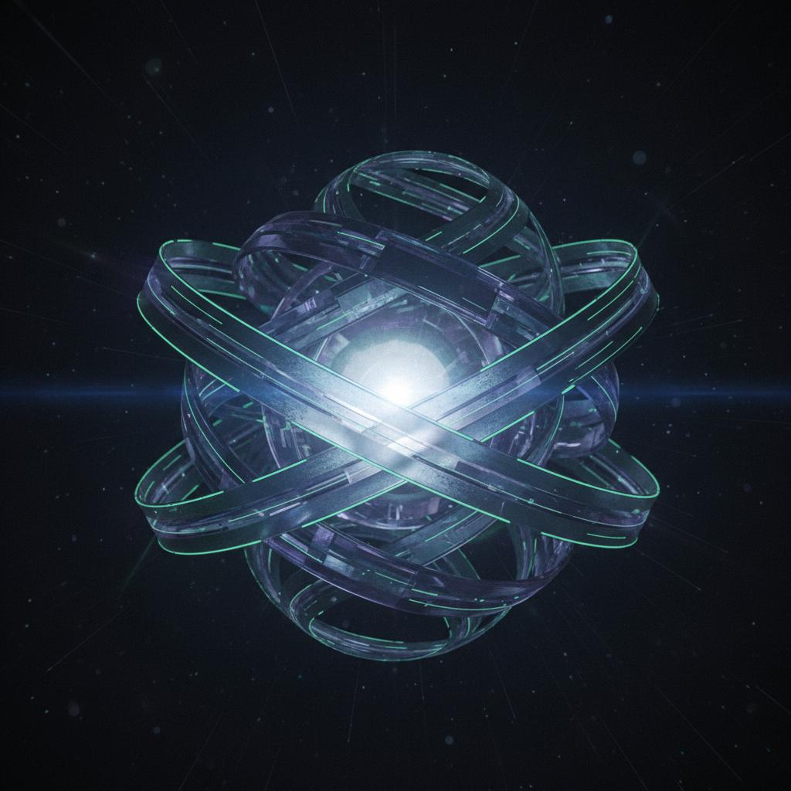

\# Portfolio --- Design → Prototype → Code

This repository hosts my personal portfolio website showcasing XR
development and Mixed Reality research projects.

Instead of starting with code, I began with storytelling and design ,
then gradually evolved the project into a fully coded, production-ready
experience. This mirrors how I approach UI/UX and XR systems ---from
intent to implementation.

\

\## 🚀 Live Demo

\[View Live Portfolio\](https://balajivelu.github.io)

\-\--

\## Workflow

\*\*Intent\*\* \"I need a space to present my work\"
&nbsp;&nbsp;&nbsp;&nbsp;&nbsp;&nbsp;&nbsp;&nbsp;↓ \*\*UX
Storyboarding\*\* Narrative • Flow • Structure
&nbsp;&nbsp;&nbsp;&nbsp;&nbsp;&nbsp;&nbsp;&nbsp;↓ \*\*UI Design
(Figma)\*\* Visual language • Layout • Interaction
&nbsp;&nbsp;&nbsp;&nbsp;&nbsp;&nbsp;&nbsp;&nbsp;↓ \*\*Interactive
Prototype (Framer)\*\* Responsive • Motion • Experience
&nbsp;&nbsp;&nbsp;&nbsp;&nbsp;&nbsp;&nbsp;&nbsp;↓ \*\*Design → Code\*\*
Vibe coding • Performance focus
&nbsp;&nbsp;&nbsp;&nbsp;&nbsp;&nbsp;&nbsp;&nbsp;↓ \*\*Deployment\*\*
GitHub Pages

\*\*Summary:\*\* Story → UX → UI → Prototype → Code → Ship

\-\--

\## ✨ Why this repo:

To document how I translate design thinking into real, working systems.

\-\--

\## 🛠️ Tech Stack

\- \*\*Prototyping:\*\* Figma, Framer - \*\*Framework:\*\* React,
TypeScript, Vite - \*\*Styling:\*\* Tailwind CSS - \*\*Animations:\*\*
GSAP, ScrollTrigger - \*\*UI Components:\*\* shadcn/ui - \*\*Icons:\*\*
Lucide React

\-\--

\## 🔗 Links

\- \*\*LinkedIn:\*\* \[Balaji
Velu\](https://www.linkedin.com/in/balaji-velu/) - \*\*Email:\*\*
balajivelu3097@gmail.com

\-\--

Built with ❤️ by Balaji Velu
