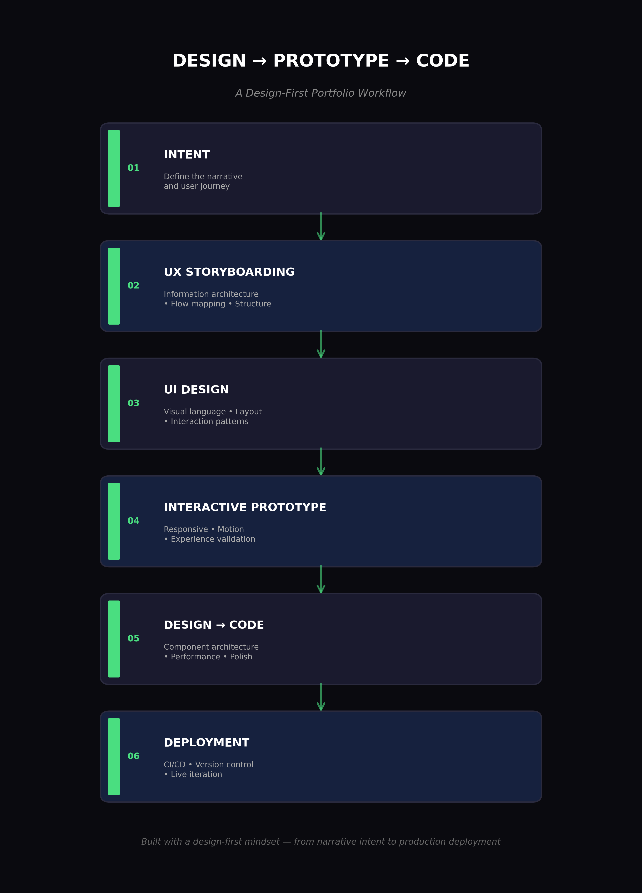

# Portfolio - Design-First Web Experience

A personal portfolio built from the ground up using a **design-first methodology**: narrative intent → UX architecture → UI design → interactive prototype → production code. This repository documents the full workflow from initial concept to live deployment.

---

## Design Philosophy

Every interface begins with intent. Before writing a line of code, the experience is mapped as a narrative: who is visiting, what they need to understand in the first 3 seconds, and how motion and hierarchy guide them through the story. The result is a site that feels intentional at every breakpoint - desktop, tablet, and mobile.

---

## 🛠️ Tech Stack

| Layer | Tools |
|-------|-------|
| **Design & Prototyping** | Figma, Framer |
| **Framework** | React + TypeScript + Vite |
| **Styling** | Tailwind CSS |
| **Motion & Interaction** | GSAP + ScrollTrigger |
| **UI Components** | shadcn/ui |
| **Icons** | Lucide React |
| **Version Control & CI/CD** | Git + GitHub Actions |

---

## 🚀 Workflow

### 01 - Intent
Define the narrative arc and user journey. Establish what a visitor should feel, understand, and do within the first scroll.

### 02 - UX Storyboarding
Map information architecture, content hierarchy, and scroll flow. Structure the experience before styling it.

### 03 - UI Design
Establish the visual language: typography scale, color system, spacing rhythm, and interaction patterns. Designed in Figma with a component-driven mindset.

### 04 - Interactive Prototype
Build a responsive, motion-rich prototype in Framer to validate the experience across devices and interaction states before committing to code.

### 05 - Design → Code
Translate the validated design system into a component architecture. Focus on performance, accessibility, and pixel-perfect fidelity to the prototype.

### 06 - Deployment
Ship via GitHub Pages with branch-based CI/CD. Iterate live using version-controlled releases.

---

## 🔗 Live Links

- **[View Live Portfolio](https://balajivelu.github.io)**
- **[LinkedIn](https://www.linkedin.com/in/balaji-velu/)**
- **[Email](mailto:balajivelu3097@gmail.com)**

---

## ✨ Why This Repository Exists

To demonstrate that strong engineering is inseparable from strong design thinking. The portfolio itself is a case study in translating UX intent into a polished, performant, and responsive web experience.

---

Designed and Vibe Coded by Balaji Velu